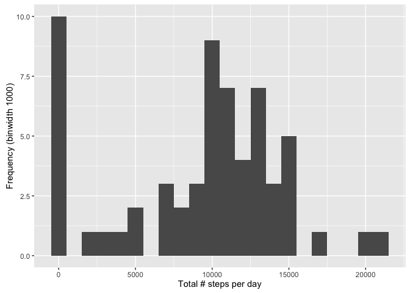
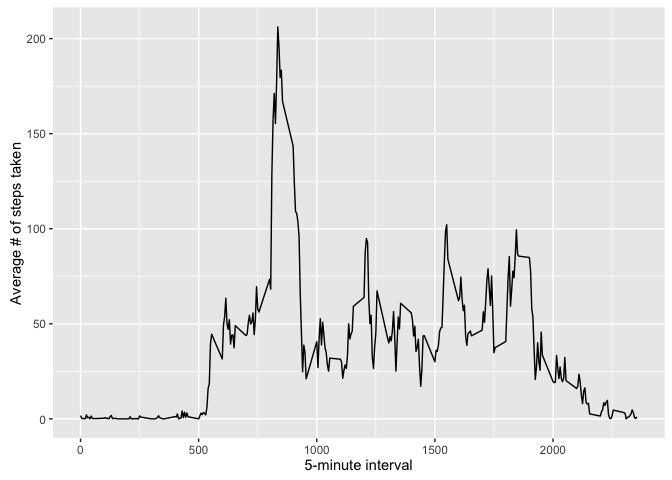
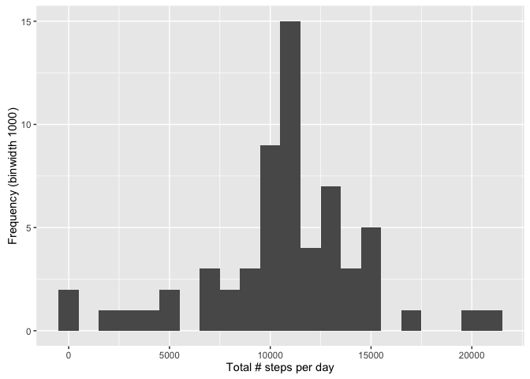
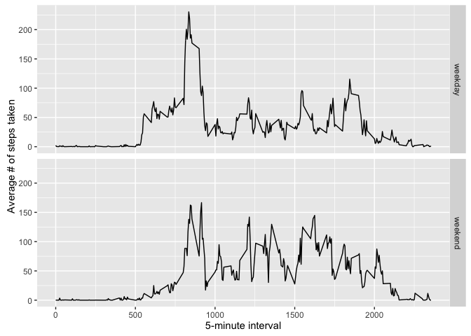

# Reproducible Research: Peer Assessment 1


## Loading and preprocessing the data


```r
library(ggplot2)
if(!file.exists('activity.csv')){
    unzip('activity.zip')
}
activity <- read.csv('activity.csv')
```

## What is mean total number of steps taken per day?

**1. Total number of steps per day**

```r
stepsPerDay <- tapply(activity$steps, activity$date, sum, na.rm=TRUE)
```
* Steps per day: 0, 126, 11352, 12116, 13294, 15420, 11015, 0, 12811, 9900, 10304, 17382, 12426, 15098, 10139, 15084, 13452, 10056, 11829, 10395, 8821, 13460, 8918, 8355, 2492, 6778, 10119, 11458, 5018, 9819, 15414, 0, 10600, 10571, 0, 10439, 8334, 12883, 3219, 0, 0, 12608, 10765, 7336, 0, 41, 5441, 14339, 15110, 8841, 4472, 12787, 20427, 21194, 14478, 11834, 11162, 13646, 10183, 7047, 0

**2. Histogram of the total number of steps per day**

```r
qplot(stepsPerDay, xlab='Total # steps per day', ylab='Frequency (binwidth 1000)', binwidth=1000)
```

<!-- -->

**3. Mean & median of the total number of steps per day**

```r
stepsPerDayMean <- mean(stepsPerDay, na.rm=TRUE)
stepsPerDayMedian <- median(stepsPerDay, na.rm=TRUE)
```
* Steps per day mean: 9354.2295082
* Steps per day median: 10395

## What is the average daily activity pattern?

**1. Average number of steps taken per 5-minute intervals, averaged across all days**

```r
averageStepsPerInterval <- aggregate(x=list(steps=activity$steps),by=list(interval=activity$interval), FUN=mean, na.rm=TRUE)
ggplot(data=averageStepsPerInterval, aes(x=interval, y=steps)) +
    geom_line() +
    xlab("5-minute interval") +
    ylab("Average # of steps taken")
```

<!-- -->

**2. 5-minute interval containing (in average) max # of steps**


```r
maxSteps <- averageStepsPerInterval[which.max(averageStepsPerInterval$steps),]
```
* 5-minute interval containing (in average) max # of steps (206.1698113): 835

## Imputing missing values

**1. Number of missing values in the dataset**

```r
lenMissingValues <- length(which(is.na(activity$steps)))
```
* Number of missing values in the dataset: 2304

**2 & 3. Fill in missing values & create new dataset**

```r
# function to check if steps is NA and then replace it with the average value of the specific 5-min interval
replaceNAValue <- function(steps, interval) {
    value <- NA
    if (!is.na(steps))
        value <- steps
    else
        value <- averageStepsPerInterval$steps[averageStepsPerInterval$interval==interval]
    return(value)
}
replacedActivity <- activity
replacedActivity$steps <- mapply(replaceNAValue, replacedActivity$steps, replacedActivity$interval)
```

**4. Total # of steps taken per day**

```r
stepsPerDay <- tapply(replacedActivity$steps, replacedActivity$date, sum)
qplot(stepsPerDay, xlab='Total # steps per day', ylab='Frequency (binwidth 1000)', binwidth=1000)
```

<!-- -->

```r
stepsPerDayMean <- mean(stepsPerDay)
stepsPerDayMedian <- median(stepsPerDay)
```
* Steps per day mean: 1.0766189\times 10^{4}
* Steps per day median: 1.0766189\times 10^{4}

Mean and median values are higher than in the original data containing NA values. The original data had days with no data at all (all step values NA), but now that the NAs were replaced with time-interval averages the number of '0 step' days significantly reduced (from 10 to 2).

## Are there differences in activity patterns between weekdays and weekends?

**1. New factor variable in the dataset with two levels (weekday, weekend)**

```r
replacedActivity$date <- as.POSIXlt(replacedActivity$date)
replacedActivity$dateType <-  ifelse(replacedActivity$date$wday %in% c(1:5), 'weekday', 'weekend')
```

**2. Comparison plot (weekday vs. weekend)**

```r
averageStepsPerInterval <- aggregate(steps ~ interval + dateType, data=replacedActivity, FUN=mean)
ggplot(averageStepsPerInterval, aes(interval, steps)) + 
  geom_line() + 
  facet_grid(dateType ~ .) +
  xlab("5-minute interval") + 
  ylab("Average # of steps taken")
```

<!-- -->


